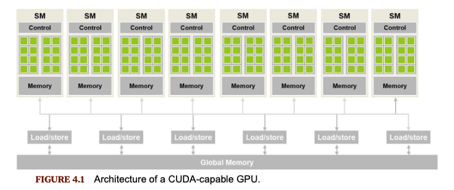

# Compute Architecture and Scheduling

<em>Picture taken form Programming Massively Parallel Processors</em>

* Each CUDA-capable GPU is organized into an array of highly-threaded Streaming Multiprocessors (SMs).
* Each SM contains multiple processing units called streaming processors (or CUDA cores) that share control logic and memory.
* Global memory is the High Bandwidth Memory (HBM).
* SMs have on-chip memory structures labeled as "Memory" in the picture.

### Block Scheduling

When a kernel is launched, the CUDA runtime creates a grid of threads. These threads are assigned to SMs on a block-by-block basis, with all threads in a block being scheduled on the same SM. Multiple blocks can also be assigned to a single SM. However, since blocks need to reserve resources, there is a limit on how many blocks can be scheduled simultaneously on a given SM. Typically, the number of blocks in a grid exceeds the number that can be concurrently assigned to the SMs. The CUDA runtime maintains a list of ready-to-execute blocks and assigns new blocks to the SMs once some previously scheduled blocks complete their execution.

Threads within a block are scheduled together on the same SM.

### Synchronization

Threads within the same block can synchronize using barrier synchronization with the `__syncthreads()` function. When a thread encounters `__syncthreads()`, it waits until all other threads in the block reach the same point in execution. This is particularly useful in scenarios like a tiled matrix multiplication kernel, where we want to ensure that all threads in a block have completed loading data from HBM to shared memory before proceeding further. It is common to perform additional work between calls to `__syncthreads()`.

In CUDA, if `__syncthreads()` is used, it must be reached by all threads within the block. If placed within a conditional branch, either all threads in the block must take that path, or none should. The `__syncthreads()` call serves as a synchronization point, and each point is distinct. Incorrect usage of this synchronization can lead to incorrect results or deadlocks.

To prevent long wait times for some threads, all threads in a block should execute in close proximity to each other. CUDA ensures that the necessary resources are allocated to all threads required to reach the synchronization point by treating the block as a unit when assigning execution resources. All threads in a block are scheduled on the same SM simultaneously, and a block begins execution only when the runtime secures the resources needed by all its threads.

Blocks can execute in any order relative to each other, as barrier synchronization is not allowed between threads in different blocks.